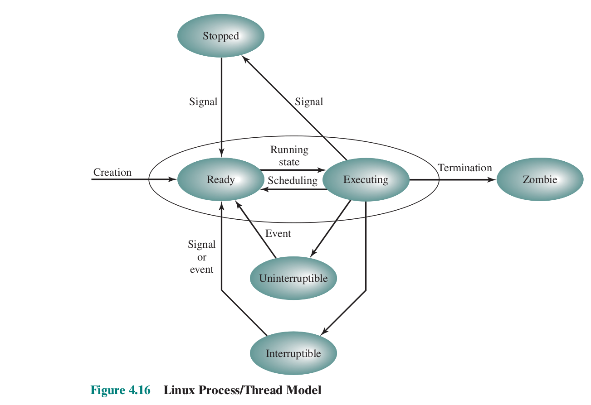

### Zadanie 1

> Przedstaw automat opisujący stan procesu w systemie Linux (rysunek 4.16 z §4.6).
> Jakie akcje lub zdarzenia wymuszają zmianę stanów?
> Uwzględnij również opuszczanie przez proces stanu zombie.
> Należy właściwie rozróżnić zdarzenia synchroniczne od asynchronicznych.
> Wyjaśnij, które przejścia mogą być rezultatem działań podejmowanych przez:
jądro systemu operacyjnego, kod sterowników, proces użytkownika albo administratora.

##### Zmiany stanu:
* _ -> ready: syscall, np. clone() **all**
* zombie process -> _: wait rodzica, jeśli nie zrobisz wait to resource leak **proces rodzica/user**
* executing -> zombie: np. kill z innego procesu, exit(), raise() - wysłanie samemu sobie sygnału **user, admin, kernel**
* executing -> stopped: np. SIGSTOP wysłany przez debugger lub użytkownika **user, admin, kernel**
* stopped -> ready: sygnał od innego procesu, np. SIGCONT, debugger **user, admin, kernel**
* executing -> uninterruptible: np. vfork **user, admin, kernel, driverrs** `mkdir`
* executing -> interruptible: np. próba wzięcia zajętego mutexu **user, admin, kernel, drivers**
* executing -> ready: scheduler **kernel**
* ready -> executing: scheduler **kernel**
* blocked -> ready: **kernel, drivers**
* executing -> blocked - błąd strony

Zdarzenia synchroniczne: creation, termination, Executing -> Uninterruptible/Interruptible
Zdarzenia asynchroniczne: sygnały, scheduling
Jądro system operacyjnego: scheduling, event (blocked->ready), event(running->stopped, stopped->ready), Termination
Kod sterowników: event(Blocked->Ready)? To nie jest tak, że jądro systemu abstrachuje wszystkie informacje od sterowników?
Proces użytkownika: wysyłanie sygnałów(np. zastopowanie, zakończenie)
Administrator: wysyłanie sygnałów (np. do zastopowania, zakończenia programu)

The Z "zombie" process state is required in order to give a parent time
to ask the kernel about the resources used by the deceased child,
using getrusage(2). A parent informs a kernel that it's done with
the child by calling waitpid.

Interruptible:
This is a blocked state, in which the process is
waiting for an event, such as the end of an I/O operation, the
availability of a resource, or a signal from another process.

Uninterruptible:
This is another blocked state. The difference
between this and the Interruptible state is that in an uninterruptible
state, a process is waiting directly on hardware conditions and
therefore will not handle any signals.

Uninterruptible Sleep State:
An Uninterruptible sleep state is one that won't handle a signal right away. It will wake only as a result of a
waited-upon resource becoming available or after a time-out occurs during that wait (if the time-out is
specified when the process is put to sleep).
The Uninterruptible state is mostly used by device drivers waiting for disk or network I/O. When the process
is sleeping uninterruptibly, signals accumulated during the sleep are noticed when the process returns from
the system call or trap. In Linux systems. the command ps -l uses the letter D in the state field (S) to
indicate that the process is in an Uninterruptible sleep state

Uninterruptible używany gdy jesteśmy w stanie ile trzeba czekać i nie chcemy
angażować skomplikowanej logiki sygnałowej. Np zapis na twardy dysk może być
uninterruptible.

Interruptible używany gdy nie da się oszacować ile się będzie czekać.
Np czytanie z gniazda sieciowego, lub z konsoli.

Zdarzenia synchroniczne:
* wystąpienie zdarzenia jest powiązane z miejscem w kodzie programu
* np. wyjątki procesora (exceptions), czy instrukcje TRAP (pułapki)

Zdarzenia asynchroniczne:
* interrupts - przerwania, np. od urządzeń peryferyjnych

##### STACKOVERFLOW:

O tym że proces może być blokujący lub nie w wywołaniu.
Nie wchodzi w interruptible ani w uninterruptible.

When a process needs to fetch data from a disk, it effectively stops running
on the CPU to let other processes run because the operation might take a
long time to complete – at least 5ms seek time for a disk is common, and 5ms
is 10 million CPU cycles, an eternity from the point of view of the program!

From the programmer point of view (also said "in userspace"), this is called
a blocking system call. If you call write(2) (which is a thin libc wrapper
around the system call of the same name), your process does not exactly stops
at that boundary: it continues, on kernel side, running the system call code.
Most of the time it goes all the way up to a specific disk controller driver
(filename → filesystem/VFS → block device → device driver), where a command
to fetch a block on disk is submitted to the proper hardware: this is a very
fast operation most of the time.

THEN the process is put in sleep state (in kernel space, blocking is called
sleeping - nothing is ever 'blocked' from the kernel point of view).
It will be awoken again once the hardware has finally fetched the proper data,
then the process will be marked as runnable, scheduled and run as soon as the
scheduler allows it to.

Finally in userspace the blocking system call returns with proper status and
data, and the program flow goes on.

It is possible to invoke most I/O system calls in non-blocking mode
(see O_NONBLOCK in open(2) and fcntl(2)). In this case, the system calls
return immediately and only tells about the proper submission of the disk
operation. The programmer will have to explicitly check at a later time if the
operation completed, with success or not, and fetch its result (e.g. with select(2)).
This is called asynchronous or event based programming.