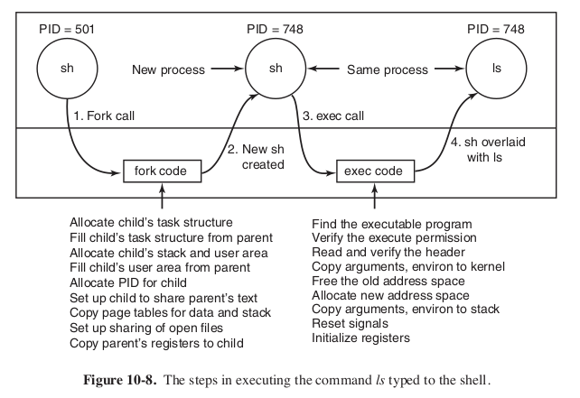

### Zadanie 2

> **Wyjaśnij różnice w tworzeniu procesów w systemie Linux i WinNT.**
> Rozważ zalety i wady obu rozwiązań.
> Czy tworzenie procesów poprzez klonowanie może być użyteczne z punktu widzenia
projektanta oprogramowania?
> **Czy ładowanie programów i tworzenie procesów powinno być osobną funkcją jądra?**
> Naszkicuj przebieg akcji podejmowanych przez jądro przy obsłudze wywołań
systemowych fork(2) i exec(2).
> W jaki sposób jądro optymalizuje tych funkcji z użyciem mechanizmu kopiowania
przy zapisie (ang. copy-on-write) i stronicowania na żądanie (ang. demand paging)?

Windows:
* Procesy to kontenery na info. Zawierają wątki które są runnable
* Poszczególne kroki. Najpierw kontener na proces, potem nowy wątek.

##### Tworzenie procesów w Linuxie
Strona 741 Tannenbaum.
1. fork() ->  kernel TRAP
2. creating task structure i inne struktury. Też `thread_info` która jest pod
stałym przesunięciem względem końca stosu procesu. Zawiera info włącznie z adresem
deskryptora procesu. FIXED LOCATION -> easy lookup
3. process descriptor content jest uzupełniany na podstawie rodzica.
4. Nadawany jest PID.
5. Na podstawie PID hashtablica i lista dwukierunkowa.
6. Alokacja pamięci na dane, segmenty stosu, kopie segmentów rodzica
(COPY ON WRITE | TEXT SHARED)
7. READY

##### Tworzenie procesów w Windowsie
Strona 919 Tannenbaum.
1. Rodzic woła CreateProcess() z winAPI, znajduje ścieżke programu w PATH
2. Parametry i ścieżka do NtCreateUserProcess() ntAPI, które otwiera obraz programu i
tworzy obiekt sekcji który możę być użyty do zmapowania programu do nowej przestrzeni adresowej.
3. Manager procesów alokuje i inicjalizuje  obiekt procesu.
4. Memory manager tworzy i ustawia przestrzeń adresową.
5. Tworzona jest tablica handlerów (od rodzica)

##### Różnice Linux vs Windows
1. The actual search path for finding the program to execute is buried in the
library code for Win32, but managed more explicitly in UNIX.
2. The current working directory is a kernel-mode concept in UNIX but a
user-mode string in Windows. Windows does open a handle on the current
directory for each process, with the same annoying effect as in UNIX: you
cannot delete the directory, unless it happens to be across the network, in
which case you can delete it.
3. UNIX parses the command line and passes an array of parameters, while Win32
leaves argument parsing up to the individual program. As a consequence,
different programs may handle wildcards (e.g., *.txt) and other special
symbols in an inconsistent way.
4. Whether file descriptors can be inherited in UNIX is a property of the handle.
In Windows it is a property of both the handle and a parameter to process creation.
5. Win32 is GUI oriented, so new processes are directly passed information about
their primary window (startupInfo argument), while this information is passed
as parameters to GUI applications in UNIX.
6. Windows does not have a SETUID bit as a property of the executable, but one
process can create a process that runs as a different user, as long as it can
obtain a token with that user’s credentials.
7. The process and thread handle returned from Windows can be used at any time
to modify the new process/thread in many substantive ways, including modifying
the virtual memory, injecting threads into the process, and altering the
execution of threads. UNIX makes modifications to the new process only between
the fork and exec calls, and only in limited ways as exec throws out all the
user-mode state of the process.

BOOL WINAPI CreateProcessAsUser(
  _In_opt_    HANDLE                hToken,
  _In_opt_    LPCTSTR               lpApplicationName,
  _Inout_opt_ LPTSTR                lpCommandLine,
  _In_opt_    LPSECURITY_ATTRIBUTES lpProcessAttributes,
  _In_opt_    LPSECURITY_ATTRIBUTES lpThreadAttributes,
  _In_        BOOL                  bInheritHandles,
  _In_        DWORD                 dwCreationFlags,
  _In_opt_    LPVOID                lpEnvironment,
  _In_opt_    LPCTSTR               lpCurrentDirectory,
  _In_        LPSTARTUPINFO         lpStartupInfo,
  _Out_       LPPROCESS_INFORMATION lpProcessInformation
);

BOOL WINAPI CreateProcess(
_In_opt_ LPCTSTR lpApplicationName, _Inout_opt_ LPTSTR
lpCommandLine,   _In_opt_    LPSECURITY_ATTRIBUTES lpProcessAttributes,
  _In_opt_    LPSECURITY_ATTRIBUTES lpThreadAttributes, _In_        BOOL                  bInheritHandles, _In_        DWORD                 dwCreationFlags
  _In_opt_    LPVOID                lpEnvironment,  _In_opt_    LPCTSTR               lpCurrentDirectory,   _In_        LPSTARTUPINFO         lpStartupInfo,		 _Out_       LPPROCESS_INFORMATION lpProcessInformation );

Z punktu widzenia projektanta oprogramowania tworzenie procesów przez
klonowanie może być użyteczne, ponieważ nie ma wtedy potrzeby przekazywania
dodatkowo jakichś elementów pamięci do procesu dziecka. (one od razu już tam są).
Daje to również możliwość używania procesów jako narzędzi do zrównoleglania obliczeń.

Kopiowanie przy zapisie (copy-on-write) polega na współdzieleniu stron.
Podczas wykonywania fork(), strony rodzica podpinane są jako strony potomka,
ustawiana jest na nich tylko dodatkowo flaga READ_ONLY. W momencie, gdy któryś
procesów próbuje pisać na stronę oznaczoną jako READ_ONLY, to strona jest
kopiowana i wyłączana jest flaga READ_ONLY. W ten sposób podczas tworzenia
nowego procesu nie trzeba kopiować zawartości całej jego pamięci ( co byłoby pracochłonne).
**Robione jest to nie tylko jeśli child próbuje zmienić. Jeśli którykolwiek z nich
zmienai to trzeba skopiować daną stronę.**

Stronicowanie na żądanie (demand-paging) polega na tym, że strony ładowane są
do pamięci dopiero wtedy, kiedy pojawi się błąd strony (page fault).
Dzięki temu, podczas startowania nowego procesu za pomocą funkcji exec nie
trzeba od razu kopiować całej zawartości pliku z obrazem programu do pamięci.
W skrócie: strony nie są ładowane dopóki nikt ich nie potrzebuje.

The main reason is likely that the separation of the fork() and exec() steps allows arbitrary setup of the child environment to be done using other system calls. For example, you can:

Set up an arbitrary set of open file descriptors;
Alter the signal mask;
Set the current working directory;
Set the process group and/or session;
Set the user, group and supplementary groups;
Set hard and soft resource limits;
...and many more besides. If you were to combine these calls into a single
spawn() call, it would have to have a **very complex interface**,
to be able to encode all of these possible changes to the child's
environment - and if you ever **added a new setting**, the interface would
need to be changed. On the other hand, separate fork() and exec() steps allow
you to use the ordinary system calls (open(), close(), dup(), fcntl(), ...)
to manipulate the child's environment prior to the exec(). New functionality
(eg. capset()) is easily supported.